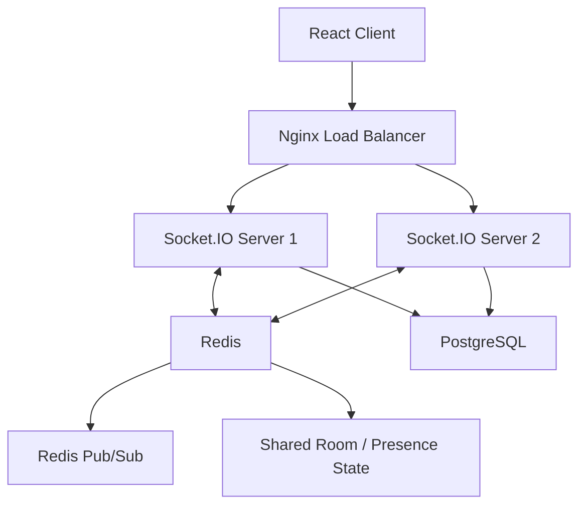

# Distributed Real-Time Chat Application

A horizontally scalable real-time messaging application built with **React, Node.js, Socket.IO, Redis, PostgreSQL, Docker, and Nginx**.

This project is a distributed-system redesign of a single-server real-time chat application I originally built about 5 years ago. The new architecture adds horizontally scaled backend instances, Redis-backed shared state and Pub/Sub, PostgreSQL persistence, Nginx load balancing, Docker, load testing, and backend failure testing.

---

## Architecture



### Request Flow

```text
                         React Client
                              |
                              v
                        Nginx :8080
                        Load Balancer
                         /          \
                        v            v
               Socket.IO Server 1  Socket.IO Server 2
                       \             /
                        \           /
                             Redis
                    Pub/Sub + Shared State
                              |
                              v
                         PostgreSQL
                      Message Persistence
```

Nginx distributes WebSocket connections across multiple Socket.IO backend instances.

Redis provides:

- Pub/Sub for cross-server real-time message propagation
- Shared room membership and user presence
- Consistent state across backend instances

PostgreSQL stores chat messages so users can retrieve recent message history when joining a room.

---

## Features

- Real-time messaging with Socket.IO
- Multiple horizontally scaled Node.js backend instances
- Nginx load balancing
- Cross-server WebSocket message delivery using Redis Pub/Sub
- Redis-backed shared room and user presence state
- PostgreSQL message persistence
- Message history retrieval when joining a room
- Dockerized backend infrastructure
- Automated concurrent-client load testing
- Backend failure and availability testing

---

## Tech Stack

### Frontend

- React
- Socket.IO Client

### Backend

- Node.js
- Express
- Socket.IO

### Data & Messaging

- Redis
- Redis Pub/Sub
- Socket.IO Redis Adapter
- PostgreSQL

### Infrastructure & DevOps

- Nginx
- Docker
- Docker Compose

---

## Distributed System Design

### Multiple Socket.IO Servers

The application runs multiple independent Socket.IO server instances:

```text
chat-server-1
chat-server-2
```

Both instances run the same Node.js application and can independently accept WebSocket connections.

This allows the backend to scale horizontally instead of relying on a single application process.

---

### Nginx Load Balancing

Clients connect to a single endpoint:

```text
http://localhost:8080
```

Nginx acts as the entry point and distributes WebSocket connections across the available backend servers.

```text
              Nginx
             /     \
            /       \
     Server 1       Server 2
```

The client does not need to know which backend instance handles its connection.

---

### Redis Pub/Sub

Without shared infrastructure, users connected to different Socket.IO servers would not receive each other's messages.

For example:

```text
User A
  |
Server 1

User B
  |
Server 2
```

Redis Pub/Sub allows Socket.IO events to propagate across backend instances:

```text
User A
  |
Server 1
  |
Redis Pub/Sub
  |
Server 2
  |
User B
```

The Socket.IO Redis adapter handles communication between server instances.

---

### Shared User and Room State

User presence cannot be stored only in local Node.js memory once multiple backend instances are running.

Redis is therefore also used to maintain shared state for:

- Connected users
- User-to-socket mappings
- Room membership

This allows either backend server to access consistent room and presence information.

---

### PostgreSQL Message Persistence

Redis is used for real-time communication and transient state, while PostgreSQL is used for durable message storage.

Each user-generated message is persisted before being broadcast:

```text
Client
  |
Socket.IO Server
  |
PostgreSQL
  |
Socket.IO Broadcast
```

When a user joins a room, recent messages are loaded from PostgreSQL and sent to the client.

System-generated messages such as join, leave, and welcome notifications are not intended to be stored as chat history.

---

## Load Testing

A custom Node.js load-testing script was created using `socket.io-client`.

The test creates multiple concurrent WebSocket clients that connect through the Nginx load balancer.

Each simulated client:

1. Establishes a WebSocket connection
2. Joins the same test room
3. Sends one message
4. Receives messages broadcast by all clients

Because every message is broadcast to every connected client:

```text
Total message deliveries =
number of clients × number of messages
```

Since each client sends one message:

```text
N clients → N × N message deliveries
```

### Test Results

| Concurrent Clients | Messages Sent | Expected Deliveries | Actual Deliveries | Errors |
| -----------------: | ------------: | ------------------: | ----------------: | -----: |
|                 50 |            50 |               2,500 |             2,500 |      0 |
|                100 |           100 |              10,000 |            10,000 |      0 |
|                200 |           200 |              40,000 |            40,000 |      0 |

The largest local test successfully handled:

```text
200 concurrent WebSocket clients
200 messages
40,000 message deliveries
0 errors
```

These tests were performed locally using Docker Compose.

The elapsed time reported by the test script is not treated as message latency because the script intentionally waits before collecting the final results.

---

## Failure Testing

Backend availability was tested by intentionally stopping one of the two Socket.IO backend instances.

For example:

```bash
docker stop chat-server-1
```

The architecture then becomes:

```text
                  Nginx
                 /     \
                X       |
         Server 1     Server 2
          DOWN          |
                         |
                       Redis
                         |
                    PostgreSQL
```

A new load test was executed while only `chat-server-2` remained available.

New WebSocket clients continued connecting through Nginx, and the remaining backend server successfully handled the traffic.

This verifies that the application does not depend on a single Node.js backend instance for new connections.

---

## Running the Project Locally

### Prerequisites

Install:

- Docker Desktop
- Node.js
- npm

---

### 1. Start the Backend Infrastructure

From the project root:

```bash
docker compose up -d --build
```

Check that the services are running:

```bash
docker compose ps
```

The stack includes:

```text
chat-server-1
chat-server-2
chat-nginx
chat-redis
chat-postgres
```

---

### 2. Start the React Client

Open another terminal:

```bash
cd client
npm install
npm start
```

For newer Node.js versions, the older Create React App configuration may require the following command in Windows PowerShell:

```powershell
$env:NODE_OPTIONS="--openssl-legacy-provider"
npm start
```

The frontend runs at:

```text
http://localhost:3000
```

The React client connects to the backend through Nginx at:

```text
http://localhost:8080
```

---

### 3. Test Multiple Users

Open multiple browser windows using different names but the same room:

```text
http://localhost:3000/chat?name=user1&room=test
```

```text
http://localhost:3000/chat?name=user2&room=test
```

Users can be routed to different backend servers while continuing to communicate through Redis Pub/Sub.

---

## Running the Load Test

Start the Docker services first:

```bash
docker compose up -d
```

Then run:

```bash
cd load-test
npm install
node load-test.js
```
